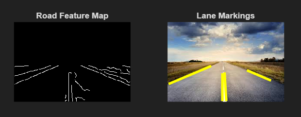
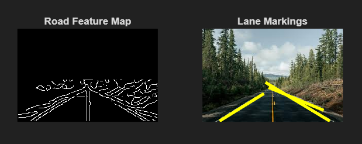

# Road Lane Detection using MATLAB

This repository contains a MATLAB-based project that analyzes a road image and highlights the road boundaries and lane markings.  
The purpose of this project is to demonstrate how image processing techniques can be applied in road structure analysis for educational and demonstration purposes.

---

## 📌 Features

- Identifies road boundaries and center divider  
- Highlights lane markings on the original road image  
- Designed for clear road images with visible lane markings  
- Simple and easy to understand MATLAB implementation  
- Suitable for academic mini projects and portfolio demonstration

---

## 🖼 Output Results

Below are the sample outputs generated by the project:

### ▶ Output 1


### ▶ Output 2


---

## ⚙ How to Run the Project

1. Download or clone this repository.
2. Open MATLAB and set the current folder to this project directory.
3. Make sure the following files are present:
   - `lane_detection.m`
   - `road.jpg`
   - `Materials/output1.png`
   - `Materials/output2.png`

4. Run the program:
   ```matlab
   lane_detection
5. The output will be displayed in MATLAB showing:

   Processed road structure

   Original image with lane markings


## 💻Requirements
 - MATLAB (R2018a or later recommended)

 - Image Processing Toolbox

## 💻Applications
 - Basic Driver Assistance System simulation

 - Road structure analysis

 - Autonomous driving concept demonstration

 - Educational computer vision learning

## ⚠ Limitations
 - Works best on images with clear and visible lane markings

 - Performance may reduce under low-light or poor weather conditions

 - Limited support for curved road scenarios

## 🚀 Future Improvements
 - Support for video-based road analysis

 - Better handling of curved lanes

 - Improved performance for night and foggy road scenarios

 - Integration with live camera input
